# Z2 Ising Gauge Monte Carlo

Monte Carlo simulation of the three-dimensional Z2 Ising gauge model.

This project studies the phase behavior of a lattice gauge system using Metropolis updates, thermalization analysis, Wilson loop measurements, Jackknife error estimation, and area/perimeter law fits.

The code is written in C, with Python scripts used for post-processing and data analysis.

---

## Table of Contents

- [Overview](#overview)
- [Physical Model](#physical-model)
- [Repository Structure](#repository-structure)
- [Simulation Methodology](#simulation-methodology)
  - [Metropolis Algorithm](#metropolis-algorithm)
  - [Energy Difference Optimization](#energy-difference-optimization)
  - [Initialization](#initialization)
  - [Thermalization](#thermalization)
- [Wilson Loops](#wilson-loops)
- [Error Analysis](#error-analysis)
  - [Temporal Error](#temporal-error)
  - [Spatial Error](#spatial-error)
  - [Jackknife Blocking](#jackknife-blocking)
- [Results](#results)
  - [Hot Start Validation](#hot-start-validation)
  - [Thermalization](#thermalization-results)
  - [Area Law](#area-law)
  - [Perimeter Law](#perimeter-law)
  - [Improved Observable](#improved-observable)
- [How to Run](#how-to-run)
- [Python Analysis Scripts](#python-analysis-scripts)
- [Requirements](#requirements)
- [Main Concepts](#main-concepts)
- [Notes](#notes)
- [Figure List](#figure-list)

---

## Overview

The Z2 Ising gauge model is a lattice gauge theory where the dynamical variables live on the links of a cubic lattice rather than on the lattice sites.

The main goal of this project is to simulate the three-dimensional Z2 gauge model and distinguish its two phases through Wilson loop observables:

- Confined phase: Wilson loops decay approximately with the enclosed area.
- Weak/deconfined phase: Wilson loops decay approximately with the perimeter.

The simulation focuses on two representative values of the inverse temperature:

```text
beta = 0.72   confined phase
beta = 0.80   weak / deconfined phase
```

The transition occurs around:

```text
beta_c ≈ 0.76
```

---

## Physical Model

The Z2 Ising gauge model is defined on a cubic lattice of size `L`.

Each link carries a spin variable:

```text
sigma_l = ±1
```

The Hamiltonian is written as a sum over plaquettes:

```text
H = -J sum_p sigma_p
```

where each plaquette contribution is the product of the four links around an elementary square:

```text
sigma_p = product of sigma_l over links in plaquette p
```

In this project, the coupling is set to:

```text
J = 1
```

The statistical weight of a configuration is given by the Boltzmann factor:

```text
P(config) proportional to exp(-beta H)
```

A key feature of this model is local gauge symmetry. Because of Elitzur's theorem, local magnetization is not a valid order parameter. Instead, gauge-invariant observables such as Wilson loops must be used.

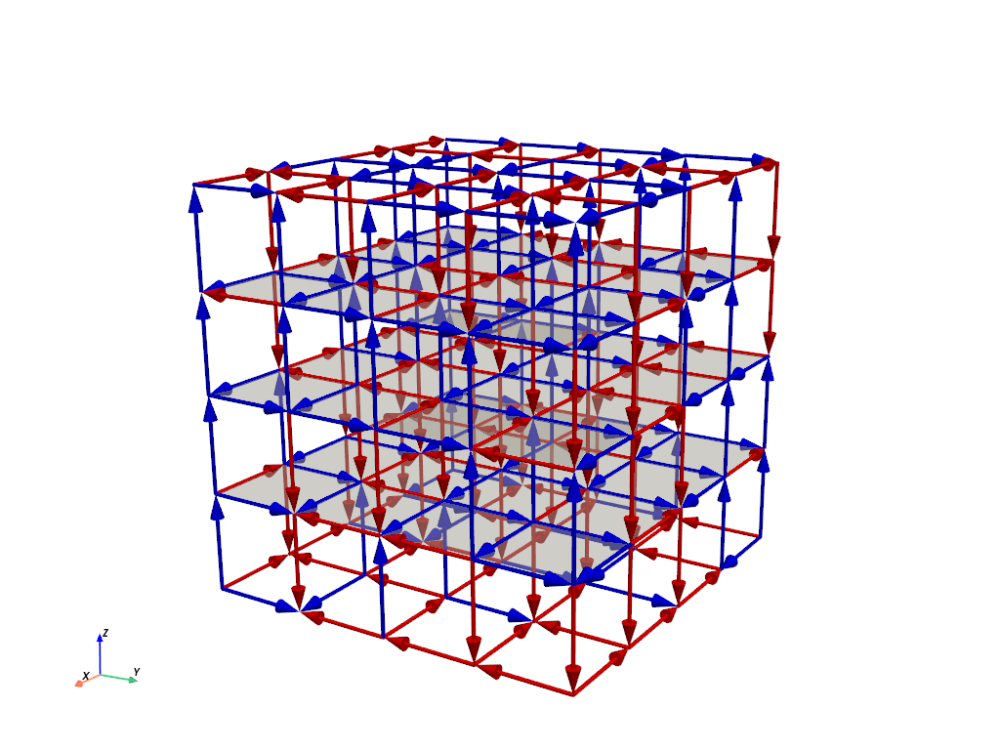

---

## Repository Structure

```text
z2-ising-gauge-monte-carlo/
├── include/
│   └── ising_gauge.h
│
├── src/
│   ├── main.c
│   ├── initialize.c
│   ├── updates.c
│   ├── measurements.c
│   └── utils.c
│
├── analysis/
│   ├── check_area_law.py
│   ├── check_perimeter_law.py
│   └── check_thermalization.py
│
├── figures/
│   ├── lattice_configuration.png
│   ├── hot_start_energy_distribution.png
│   ├── thermalization_delta_energy_beta072.png
│   ├── thermalization_convergence_beta072.png
│   ├── thermalization_convergence_beta080.png
│   ├── jackknife_beta080_sequential_sweep0.png
│   ├── jackknife_beta072_sequential_sweep0.png
│   ├── area_law_beta072.png
│   ├── perimeter_law_beta080.png
│   ├── improved_observable_variance.png
│   └── improved_area_law_beta072.png
│
├── results/
├── Makefile
└── README.md
```

---

## Simulation Methodology

The simulation uses Monte Carlo sampling to generate gauge-field configurations distributed according to the Boltzmann weight.

The main steps are:

1. Initialize the lattice.
2. Thermalize the system.
3. Generate statistically separated configurations.
4. Measure Wilson loops.
5. Estimate errors using blocked Jackknife.
6. Fit Wilson loops to area-law or perimeter-law behavior.

---

## Metropolis Algorithm

The simulation uses the Metropolis algorithm.

At each update, one link is selected and a spin flip is proposed:

```text
sigma_l -> -sigma_l
```

The change is accepted with probability:

```text
P_accept = min(1, exp(-beta DeltaE))
```

where:

```text
DeltaE = E_new - E_old
```

If `DeltaE <= 0`, the update is always accepted. Otherwise, the update is accepted with probability `exp(-beta DeltaE)`.

Two update strategies are considered:

- Random Metropolis updates.
- Sequential lattice sweeps.

Sequential sweeps were found to provide better decorrelation behavior for the final measurements.

---

## Energy Difference Optimization

A direct computation of the full energy before and after each spin flip would be expensive.

Instead, the simulation exploits locality.

In a three-dimensional cubic lattice, each link belongs to four plaquettes. Flipping one link only changes the sign of those four plaquettes.

Therefore, the energy difference can be computed locally:

```text
DeltaE = 2J sum_p sigma_p
```

where the sum runs only over the four plaquettes containing the selected link.

Since each plaquette is ±1, only five possible values of `DeltaE` can occur:

```text
DeltaE = -8, -4, 0, 4, 8
```

This allows the Metropolis probabilities to be precomputed, improving simulation speed.

---

## Initialization

Two different initial conditions are used:

### Hot start

A hot start initializes each link randomly:

```text
sigma_l = ±1 with equal probability
```

This represents the infinite-temperature limit, where the system is maximally disordered.

### Cold start

A cold start initializes the lattice in an ordered low-energy configuration.

This corresponds to the zero-temperature limit, where plaquette products are aligned.

Comparing both initializations is useful to verify that the simulation reaches the same equilibrium state independently of the starting configuration.

---

## Thermalization

Before taking measurements, the system must be thermalized.

The thermalization algorithm compares the evolution of ordered and disordered initial conditions. The system is considered thermalized when:

- The average energy change per block becomes close to zero.
- The ordered and disordered configurations converge to compatible equilibrium energies.
- The final energies agree within a chosen tolerance.

This avoids taking measurements from transient configurations.

---

## Wilson Loops

Wilson loops are the main observables used to study the phase structure.

For a closed square loop of side length `n`, the Wilson loop is defined as the product of the link variables around the contour:

```text
W(n) = product of sigma_l along closed loop
```

The expectation value:

```text
<W(n)>
```

is measured for several loop sizes.

In this project, square Wilson loops are measured in the three lattice planes:

```text
XY, YZ, ZX
```

This averaging restores rotational symmetry statistically and reduces noise.

---

## Error Analysis

Monte Carlo simulations produce correlated samples. Therefore, error estimation requires care.

The project analyzes two main sources of uncertainty:

- Temporal correlations between successive configurations.
- Spatial fluctuations between loops measured inside the same configuration.

---

## Temporal Error

Successive configurations are not independent unless they are separated by a sufficient number of Monte Carlo updates.

To address this, the simulation studies how the Jackknife error changes with the block size.

If the block size is smaller than the autocorrelation time, the error is underestimated. Once the block size is large enough, the Jackknife error should stabilize.

---

## Spatial Error

For each configuration, many Wilson loops are measured at different spatial positions and orientations.

Since individual loop measurements satisfy:

```text
w = ±1
```

the spatial variance within a configuration is estimated using:

```text
sigma_i^2 = <w^2> - <w>^2 = 1 - <w>^2
```

This spatial uncertainty is combined with temporal error estimates.

---

## Jackknife Blocking

The Jackknife method is used to estimate statistical errors from blocked data.

The idea is to group consecutive configurations into blocks and compute the observable after removing one block at a time.

For a block size `B`, the method estimates how the error depends on the degree of temporal averaging.

The project compares several block sizes:

```text
1, 2, 4, 8, 16, 32, 64, 128
```

The final block size is chosen when the error stabilizes.

---

## Results

The project studies several aspects of the simulation:

- Validation of random hot starts.
- Thermalization from ordered and disordered configurations.
- Wilson loop decay in the confined phase.
- Wilson loop decay in the weak phase.
- Error behavior under Jackknife blocking.
- Variance reduction through an improved observable.

---

## Hot Start Validation

For a hot start, the initial energy per plaquette is expected to follow a Gaussian distribution centered around zero.

This is a consequence of the central limit theorem, since the total energy is a sum of many approximately independent plaquette contributions.

The simulation verifies that the random initialization reproduces the expected distribution.

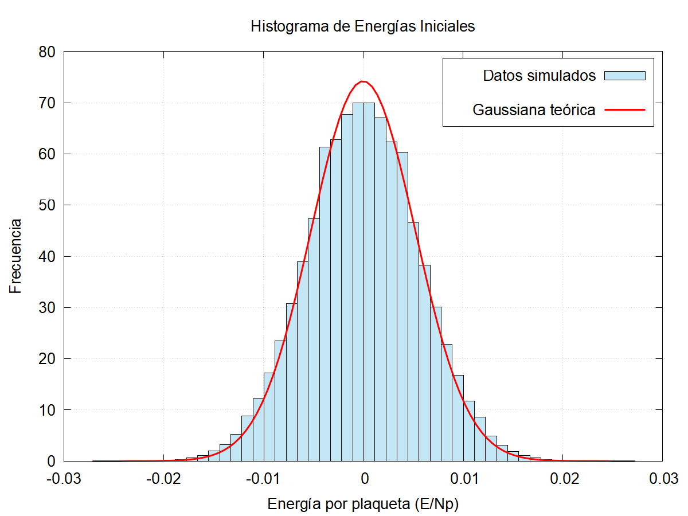

---

## Thermalization Results

The thermalization process is checked by monitoring the average energy change and the convergence of ordered and disordered starts.

At `beta = 0.72`, the system reaches equilibrium after a relatively short transient.

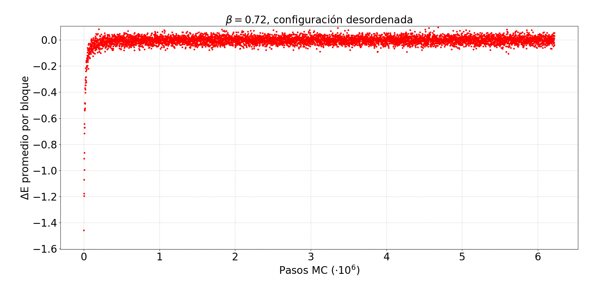

The convergence of ordered and disordered configurations confirms that the system reaches a common equilibrium state.

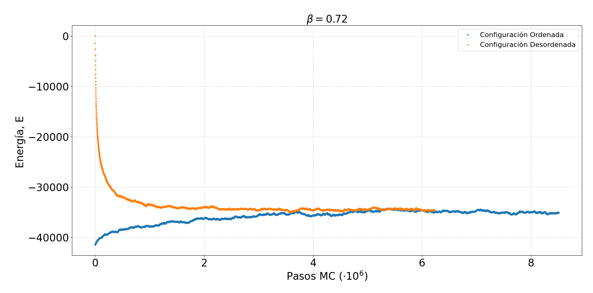

At `beta = 0.80`, closer to the weak/deconfined regime, thermalization requires more Monte Carlo steps.

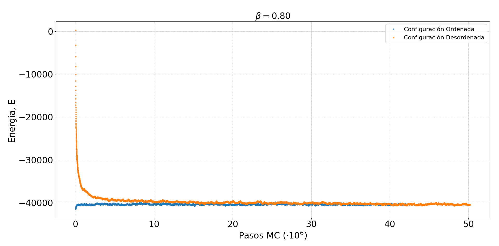

---

## Jackknife Error Behavior

The Jackknife analysis is used to determine suitable block sizes and compare update strategies.

For `beta = 0.80`, sequential Metropolis sweeps without overrelaxation show a clearer stabilization of the Jackknife error.

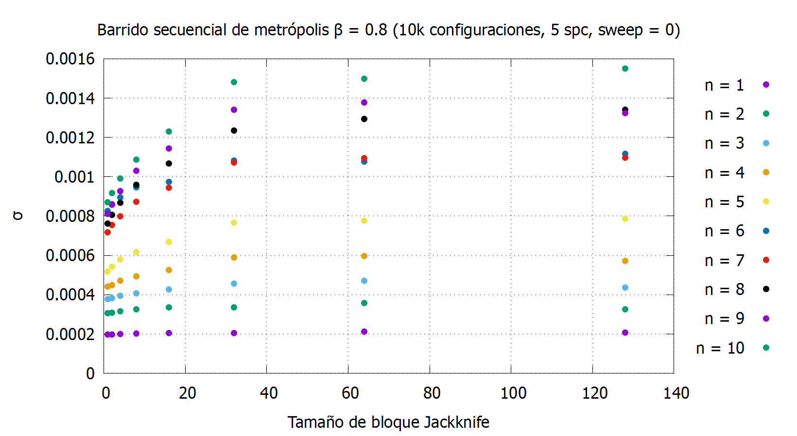

For `beta = 0.72`, the confined phase produces rapidly decaying Wilson loops and higher relative noise for large loops.

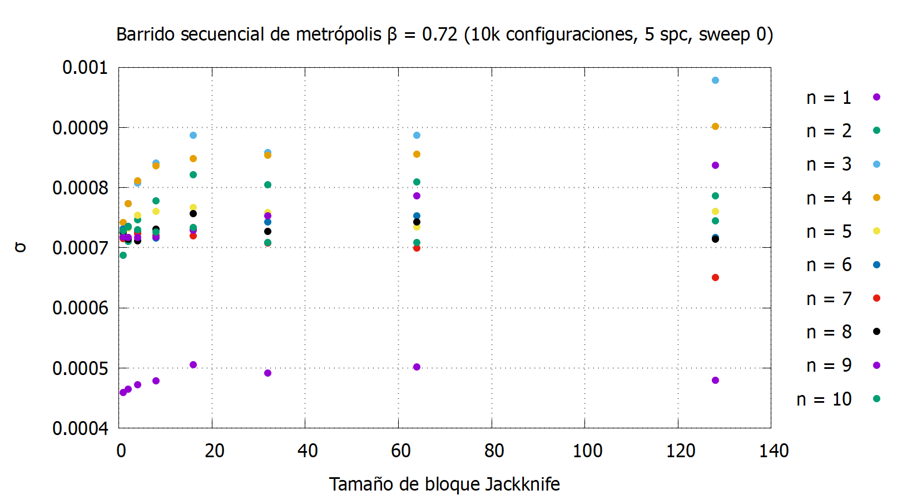

The final measurement setup uses sequential sweeps with a block size chosen from the observed Jackknife stabilization.

---

## Area Law

In the confined phase, Wilson loops are expected to follow an area law:

```text
<W(n)> ≈ A exp(-B n^2)
```

where `n^2` is proportional to the area enclosed by a square loop.

The area law is studied at:

```text
beta = 0.72
```

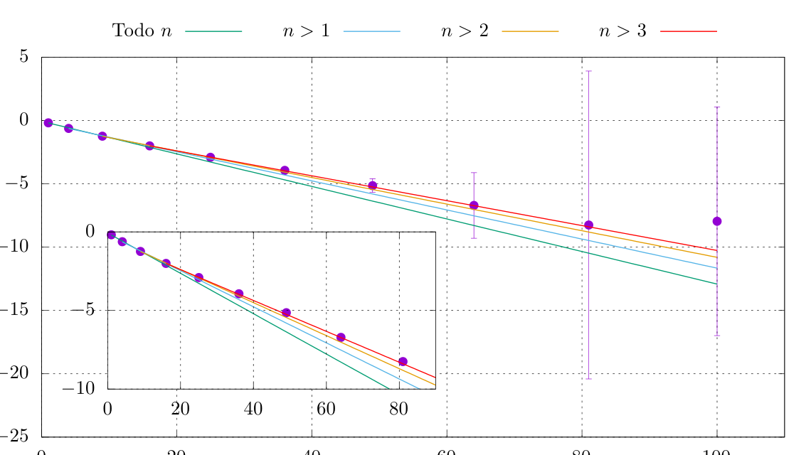

This behavior is characteristic of the confined phase, where large Wilson loops decay rapidly with the enclosed area.

---

## Perimeter Law

In the weak/deconfined phase, Wilson loops are expected to follow a perimeter law:

```text
<W(n)> ≈ A exp(-B 4n)
```

where `4n` is the perimeter of a square loop.

The perimeter law is studied at:

```text
beta = 0.80
```

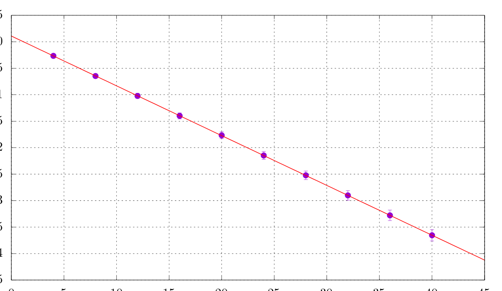

Compared with the confined phase, the Wilson loop expectation values decay more slowly.

---

## Improved Observable

The project also explores a variance-reduced observable for Wilson loops.

The idea is to reduce fluctuations by replacing selected links with their conditional expectation value, while preserving the physical expectation value of the observable.

This produces smaller statistical errors, especially for large Wilson loops.

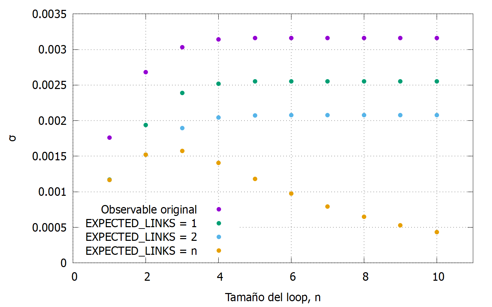

The improved observable is also tested in the area-law regime.

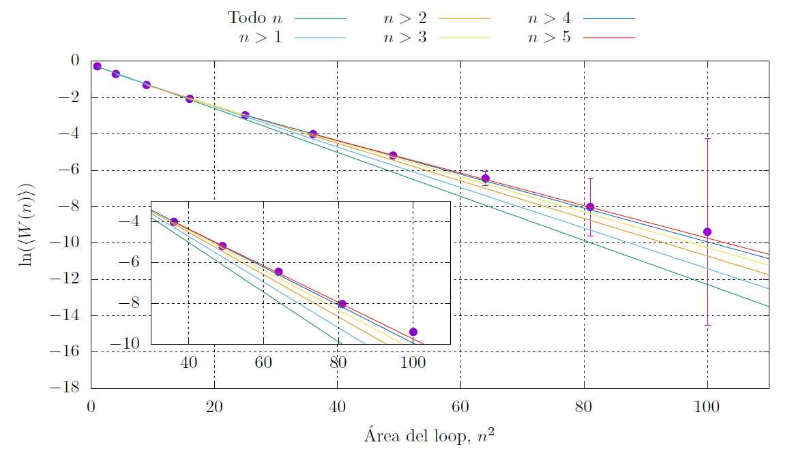

This shows how analytical insight into local link distributions can be used to improve Monte Carlo measurements.

---

## How to Run

Compile the C code:

```bash
make
```

Run the simulation:

```bash
./ising_gauge
```

Clean compiled files:

```bash
make clean
```

---

## Python Analysis Scripts

The `analysis/` folder contains Python scripts for post-processing simulation data.

### Area law fit

```bash
python analysis/check_area_law.py results/your_data_file.txt
```

Fits Wilson loop data to:

```text
W(n) = A exp(-B n^2)
```

### Perimeter law fit

```bash
python analysis/check_perimeter_law.py results/your_data_file.txt
```

Fits Wilson loop data to:

```text
W(n) = A exp(-B 4n)
```

### Thermalization check

```bash
python analysis/check_thermalization.py results/your_thermalization_file.txt
```

Plots the average energy variation during thermalization.

---

## Requirements

C compiler:

```text
gcc
make
```

Python packages:

```text
numpy
matplotlib
scipy
```

Install Python dependencies with:

```bash
pip install numpy matplotlib scipy
```

---

## Main Concepts

This project covers:

- Z2 lattice gauge theory.
- 3D cubic lattices.
- Periodic boundary conditions.
- Plaquette Hamiltonians.
- Metropolis Monte Carlo.
- Hot and cold starts.
- Thermalization.
- Wilson loops.
- Gauge-invariant observables.
- Confined and weak/deconfined phases.
- Area law.
- Perimeter law.
- Jackknife error estimation.
- Temporal and spatial correlations.
- Variance reduction.

---

## Notes

This repository is intended as a computational physics project.

The goal is not to build a general-purpose lattice gauge theory engine, but to implement and analyze a focused Monte Carlo simulation of the 3D Z2 Ising gauge model.

The report is not included in the repository, but the README summarizes the main physical ideas, numerical methods, and results.

---

## Figure List

The README expects the following figures inside the `figures/` folder:

```text
figures/
├── lattice_configuration.png
├── hot_start_energy_distribution.png
├── thermalization_delta_energy_beta072.png
├── thermalization_convergence_beta072.png
├── thermalization_convergence_beta080.png
├── jackknife_beta080_sequential_sweep0.png
├── jackknife_beta072_sequential_sweep0.png
├── area_law_beta072.png
├── perimeter_law_beta080.png
├── improved_observable_variance.png
└── improved_area_law_beta072.png
```
